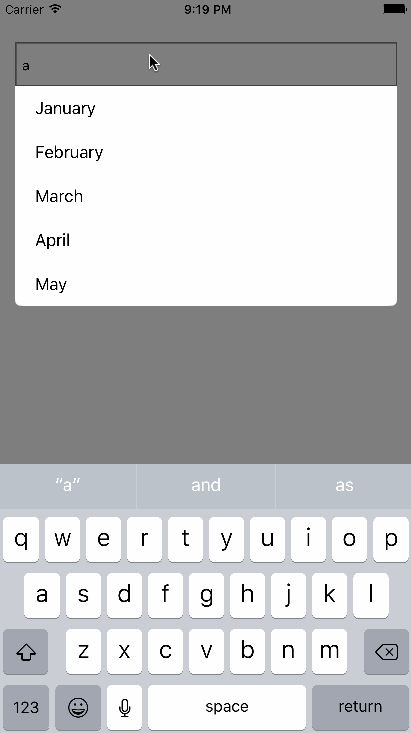

# UITextField_AutoSuggestion

[](https://travis-ci.org/Kassymov Shyngys/UITextField_AutoSuggestion)
[](http://cocoapods.org/pods/UITextField_AutoSuggestion)
[](http://cocoapods.org/pods/UITextField_AutoSuggestion)
[](http://cocoapods.org/pods/UITextField_AutoSuggestion)



## Example

To run the example project, clone the repo, and run `pod install` from the Example directory first.

## Requirements

* iOS version >= **8.0**

## Installation

UITextField_AutoSuggestion is available through [CocoaPods](http://cocoapods.org). To install
it, simply add the following line to your Podfile:

```ruby
pod "UITextField_AutoSuggestion"
```

## Author

Kassymov Shyngys, chika.kasymov@gmail.com

## License

UITextField_AutoSuggestion is available under the MIT license. See the LICENSE file for more info.
